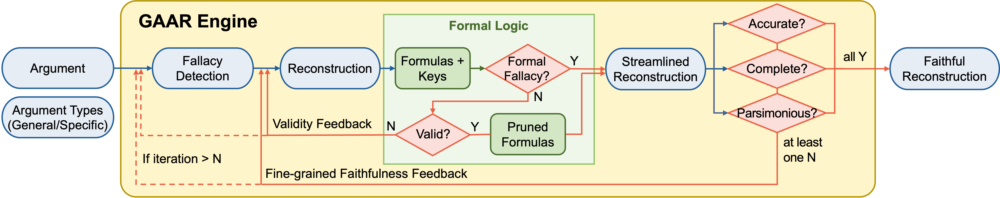

# Argument Reconstruction as Supervision for Critical Thinking in LLMs

[](https://arxiv.org/abs/2603.17432)  [](#bibtex)

Implementation of **GAAR** (**G**eneralized **A**utomatic **A**rgument **R**econstruction) and **Arguinas** (**Argu**ment reconstruct**i**o**n**) dat**a**set as presented in our paper:  
[**Argument Reconstruction as Supervision for Critical Thinking in LLMs**](https://arxiv.org/abs/2603.17432)  
by Hyun Ryu<sup>\*1,2</sup>, Gyouk Chu<sup>\*2</sup>, Gregor Betz<sup>3</sup>, Eunho Yang<sup>2</sup>, Carolyn Rosé<sup>†1</sup>, and Sean Welleck<sup>†1</sup>  
<sup>1</sup>Language Technologies Institute, Carnegie Mellon University &nbsp;&nbsp; <sup>2</sup>Graduate School of AI, Korea Advanced Institute of Science & Technology &nbsp;&nbsp; <sup>3</sup>Department of Philosophy, Karlsruhe Institute of Technology &nbsp;&nbsp; <sup>\*</sup>Equal Contribution  &nbsp;&nbsp; <sup>†</sup>Equal Advising

<p align="center">
  
</p>

---

## 🔔 Updates
- [✔] (25.04.21) The code implementation of GAAR and Arguinas dataset are out.
- [✔] (26.03.18) Paper is out! [here](https://arxiv.org/abs/2603.17432) 

--- 

## 🔧 Environment Setup

Follow the steps below to set up your environment:

1. Create a Python virtual environment using e.g. Conda:
```bash
conda create -n arguinas python=3.12 && conda activate arguinas
```

2. Install dependencies:
```bash
pip install -r requirements.txt
```

3. Configure API keys

Copy `.env.example` to `.env` and fill in your keys:

```bash
cp .env.example .env
```

Then edit `.env`:

```
ANTHROPIC_API_KEY=sk-ant-...
OPENAI_API_KEY=sk-proj-...
```

You only need to set the key(s) for the model family you intend to run (Anthropic for Claude models, OpenAI for GPT models).

## 🚀 Usage

Run the pipeline with default arguments:

```bash
python run_GAAR.py
```

This is equivalent to:

```bash
python run_GAAR.py \
  --data_path ./data/Sample \
  --data_filename sample.json \
  --use_general_reconstruction True \
  --use_specific_reconstruction False \
  --save_path ./output \
  --prompt_path ./prompts/GAAR \
  --subset sample \
  --model_name claude-sonnet-4-5-20250929 \
  --max_num_recon 10 \
  --max_num_debug 5 \
  --max_attempts 5
```

Outputs are written to `./output/reconstruction_<subset>_<model_name>.json`.

## 🏋️ Data

Our train and test Arguinas datasets live in [`data/`](./data). See [`data/README.md`](./data/README.md) for the full data format (top-level columns, `fallacy_info`, `sections`, etc.).

### Expected input format for `run_GAAR.py`

`run_GAAR.py` only reads three fields from each entry in the input JSON:

| Field | Type | Description |
|---|---|---|
| `title` | `string` | The debate topic. |
| `background` | `string` | Background context (`"None"` if absent). |
| `argument` | `string` | The raw argument text to reconstruct. |

See [`data/Sample/sample.json`](./data/Sample/sample.json) for a minimal working example, and [`output/reconstruction_sample_claude-sonnet-4-5-20250929.json`](./output/reconstruction_sample_claude-sonnet-4-5-20250929.json) for a corresponding sample output produced by the pipeline.

To run on your own data, place a JSON file with the same schema under any directory and point `--data_path` / `--data_filename` to it.

## 📊 Prompts

All prompt templates used by each stage of the pipeline (fallacy detection, reconstruction, validity checking, streamlining, faithfulness checking, program debugging) live under [`prompts/GAAR/`](./prompts/GAAR). Refer to these files to see or modify the instructions given to the LLM at each step.

Two reconstruction variants are provided:
- **General** (`reconstruction_general_*.txt`) — classifies reasoning into 4 broad types (deductive / inductive / analogical / abductive).
- **Specific** (`reconstruction_60_types_*.txt`) — classifies reasoning into 60 fine-grained Walton-style argumentation schemes.

Toggle between them with the `--use_general_reconstruction` / `--use_specific_reconstruction` flags.

## 📚 BibTeX
If you find this repo useful for your research, please consider citing us:

```
@article{ryu2026argument,
  title={Argument Reconstruction as Supervision for Critical Thinking in LLMs},
  author={Ryu, Hyun and Chu, Gyouk and Betz, Gregor and Yang, Eunho and Rose, Carolyn and Welleck, Sean},
  journal={arXiv preprint arXiv:2603.17432},
  year={2026}
}
```

## ✉️ Contact
If you have any questions or feedback, feel free to reach out:
- Hyun Ryu: ryuhyun1905@kaist.ac.kr
- Gyouk Chu: kyouwook@kaist.ac.kr
